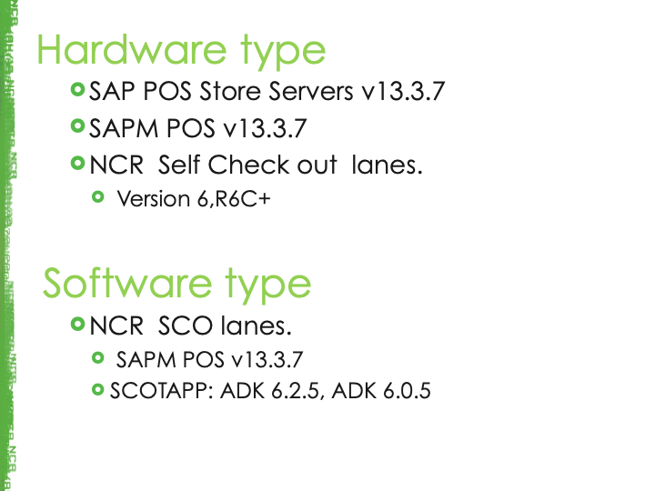

# KYC (Know Your Customer): Dollarama

## WHY?
This research was done to know about customer and what could we expect in future from them as a new features and improvements.

***
 

## AGENDA

***
 

## Dollarama Introduction

***
 

## Types of Store

***
 

## Dollarama in Numbers

***
 

## Dollar stores visited most frequently in Canada as of August 2019

***
 

## Hardware & Software Type

***
 

## Store Locations, Online Delivery & Mobile App Shopping

***
 

## WIKI Details

***
 

## Customer Goals

***
 

## Goals Vs Objective

***
 

## How SCO Helped?

***
 

## Evaluation of Campaign

***
 

## Recent Business Changes

***
 

## Road Maps

***
 
